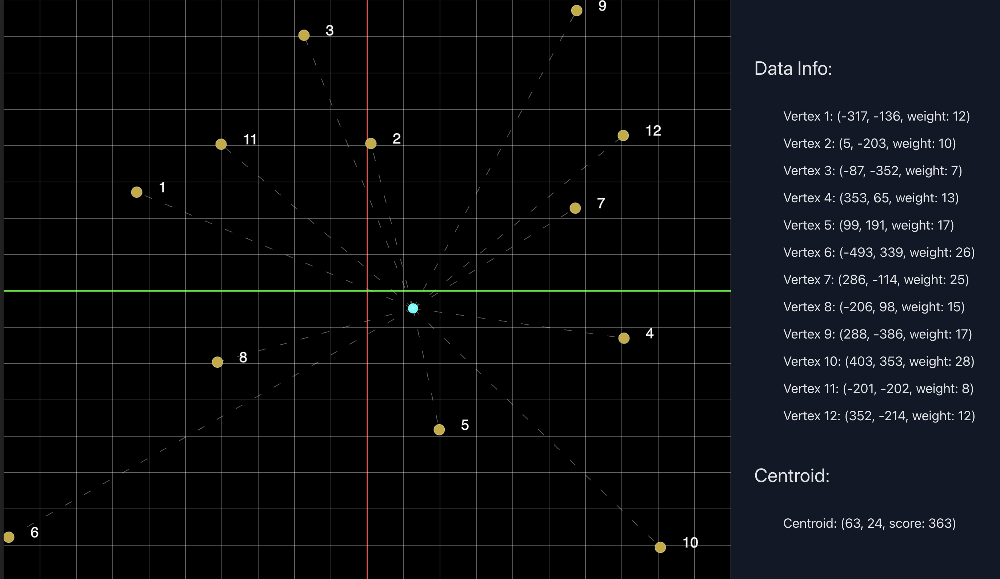

<div align="center">
  <h1>finding-centroids</h1>
  <h3>A p5.js sketch to visualize 2D weighted-means calculation</h3>
  
</div>

A p5.js sketch visualization of finding the average (or centroid) of a set of weighted points on a 2D cartesian grid. This repository contains the code for the sketch as well as a brief explanation of the math behind the centroid calculation, but is only a small part of [Force Drawn Graphs](https://github.com/horaciovelvetine/ForceDrawnGraphs). This concept was the first step in the development of the Force Drawn Graphs project, and led to my subsequent discovery of K-Means Clustering, Graphs, and solutions already implemented such as the Kamada-Kawai, and Fruchterman-Reingold algorithms. 

The math here is strikingly simple, and the intent is to provide a means of bridging the problem solving process towards more complex solutions. 

## The Problem
Given a set of `vertices`, each with [x,y] coordinates, and a matching set of `edges` with weights, what is the best way to calculate an average point which best represents the entire set? 

## The Components of the Problem

- "A set of vertices" can be any length, but will always have 3 attributes which are important to the calculation: `x`, `y`, and `weight`.
- Weight can be thought of as the importance of the vertex in the calculation of the centroid, and in the larger context of [FDG](https://github.com/horaciovelvetine/ForceDrawnGraphs) a way of representing the strength of the relationship between two Wikipedia entries.
- 'calculate an average' is a bit of a misnomer, as the centroid is not necessarily the average of the points, but rather the point which minimizes the sum of the squared distances between itself and all other points or, **"best represents the entire set"**. However, the math to arrive at the solution is the same as calculating any average, with a minor adjustment to account for the weights, and is easy find.

## The Math

The mean of a set of points is calculated by taking the average of the x and y coordinates of all the points. This is done by summing all the x and y coordinates and dividing by the number of points. 

```javascript
function findAverage(vertices) {
  let xSum = 0;
  let ySum = 0;

  for (let i = 0; i < vertices.length; i++) {
    xSum += vertices[i].x;
    ySum += vertices[i].y;
  }

  let xAvg = xSum / vertices.length;
  let yAvg = ySum / vertices.length;

  return [xAvg, yAvg];
}
```

The weighted mean is calculated by taking the sum of the x and y coordinates multiplied by the weight of each point, and dividing by the sum of the weights.

```javascript

function findWeightedAverage(vertices) {
  let xSum = 0;
  let ySum = 0;
  let weightSum = 0;

  for (let i = 0; i < vertices.length; i++) {
    xSum += vertices[i].x * vertices[i].weight;
    ySum += vertices[i].y * vertices[i].weight;
    weightSum += vertices[i].weight;
  }

  let xAvg = xSum / weightSum;
  let yAvg = ySum / weightSum;

  return [xAvg, yAvg];
}
```

So far, this has been expressed in simple arithmetic, but the weighted mean has a much more intimadating mathmatical representation which can serve as a barrier to understanding for many, and thats simply because of its notation.

The weighted mean of a set of values is given by:

$$ \bar{x} = \frac{\sum_{i=1}^{n} w_i x_i}{\sum_{i=1}^{n} w_i} $$

Where:
- $\bar{x}$ is the weighted mean,
- $w_i$ are the weights,
- $x_i$ are the values,
- $n$ is the number of values.

This formula represents the sum of each value multiplied by its corresponding weight, divided by the sum of all weights. But programatically, this is just a simple division and multiplication, the notation merely provides a means of expressing that were performing this operation over a **set** of values.

The above expression has a few different ways of being written, but I prefer the above as its the most explicit, and can each member of the equation can be pretty explicitly linked to the code and helped with visualization:


In the above image, the vertices are represented as orange circles, and the weighted mean is represented as a cyan circle. The strength of the relationship between the vertices is represented by the radius of the outer circle, and the weight of the vertices are listed in the sidebar. Provided a visual example of the math in action and real world values, the math is suddenly much more approachable, bordering on intuitive as expressed above.

## Extending the Math

The larger context of this intended solution can be found in the [Force Drawn Graphs](https://github.com/horaciovelvetine/ForceDrawnGraphs) repository. The fundamental math here of finding the weighted mean was the first step in finding a solution to the problem of building a visual representation of the relationships between Wikipedia articles. In my process, I had no idea that this was a solved problem, and a branch of mathematics called [Graph Theory](https://en.wikipedia.org/wiki/Graph_theory#:~:text=In%20mathematics%2C%20graph%20theory%20is,arcs%2C%20links%20or%20lines). But the how of A -> Graph Theory is normally the part of the story that is omitted, and I wanted to provide a better understanding of the problem solving process.

Given the ability to calculate a weighted means, the next step was integrating it into a larger solution, and since this was never actual code, lets pseudo code it.

```javascript
  const WikipediaGraphset = GetWikipediaGraphsetFromTBD();
  const centerOfTheUniverse = findKevinBacon(WikipediaGraphset); // using kevin bacon as a placeholder for the center of the universe "[0,0]"

  for (Edge edge in centerOfTheUniverse.edges()) { // iterate over starting vertex edges
    const vertex = edge.targetVertex(); // gets target vertex of edge
    const weight = edge.weight(); // gets weight of the relevant edge edge
    const weightedMean = findWeightedAverage(vertex.edges()); // set it in the center of the new 'universe'
    const distance = calculateDistance(centerOfTheUniverse, weightedMean); // calculate the distance between the two original points
    const force = calculateForce(distance, weight); // calculate the force between the two points
    applyForceToVertex(vertex, force); // apply the force to the vertex to plot it back in the original universe
  }

```
The intent was to then recursively apply the same process to each of the `n` vertices, until there was a solution for the entire set (where `n` would be some set size limitation tbd). While this was a sort of solution, it had a variety conceptual holes, and was not a complete solution by any means. 

In googling about finding the mean of a [x,y] dataset I found some information about a statistacal method called [K-Means Clustering](https://en.wikipedia.org/wiki/K-means_clustering). In statistics K-Means clustering is a method of grouping a large dataset into smaller groups, and can provide insight into relationships between individual members of the data that arent immediately apparent. This provided a new direction, as well as playing with a js implementation I found here: [K-Means Clustering in JS](https://github.com/stevemacn/kmeans). In addition to exploring K-Means clustering I explored some alternative means of displaying visuals, and given my background in React, I found a library called [D3.js](https://d3js.org/), and hilariously this example of the movie Les Miserables: [D3.js Force Directed Graph](https://observablehq.com/@d3/force-directed-graph), when I first stumbled upon the term I didn't know I was looking for - *Force-directed graph*.

It wasn't long before I switched to Java for a bit more speed, and flexibility for handling large datasets (and I was learning Spring & Spring-Shell), and I found a library called [JUNG](https://jung.sourceforge.io/), to arrive at the tools I will be leveraging to continue exploring this topic, and trying to create Wikipedia in 3D space

[Read More: Force Drawn Graphs](https://github.com/horaciovelvetine/ForceDrawnGraphs)

## Running The Visualization


The p5.js sketch included in `finding_centroids.js` renders a configurable (see: `constants.js`) numbers of vertices on a 2D cartesian grid, and calculates the average of the points. The average is displayed as a centroid (in cyan), and the vertices are displayed numbered (in orange).

In order to get this running locally fork and clone this repository. Run `npm install` to install all of the required node dependencies, and then run `npm run dev` to start the local vite server. The default url will be used unless otherwise configured, and you should be provided that link in the terminal output to open a tab in the browser.

## References

- [Stack Exchange:The correct formula for weighted average](https://stats.stackexchange.com/questions/401114/the-correct-formula-for-weighted-average)
- [Wolfram MathWorld: Weighted Mean](https://mathworld.wolfram.com/WeightedMean.html)
- [Wikipedia Weighted Arithmetic Mean](https://en.wikipedia.org/wiki/Weighted_arithmetic_mean)
- [Naive Sharding in K-Means Initialization](https://www.kdnuggets.com/2017/03/naive-sharding-centroid-initialization-method.html)
- [Implementing K-Means Clustering From Scratch in Javascript](https://medium.com/geekculture/implementing-k-means-clustering-from-scratch-in-javascript-13d71fbcb31e)