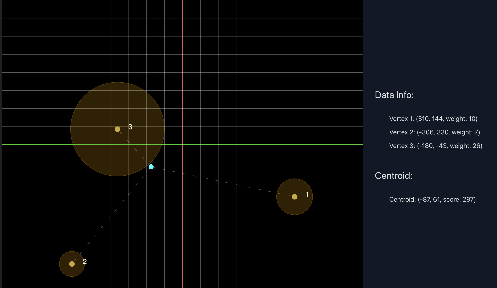

<div align=center>
  <h1>finding-centroids</h1>
  <h3>A p5.js sketch to visualize 2D weighted-means calculation as a means of creating a layout for a random graphset. This is only a potential solution for <a href=https://github.com/horaciovelvetine/wikidata-universe-client>the Wikiverse project</a>. Ultimately the field of <a href=https://en.wikipedia.org/wiki/Graph_theory>Graph Theory</a> has solved these problems with a variety of innovations, solutions, and optimizations, but the barrier to entry can be intimidating without a background in math. This solution contains intuitive and simple math which is a great bridge towards Graph Theory based solutions, and should help develop an intuitive understanding of how layouts are created.
  </h3>
</div>

<ul align=center>
  
  
</ul>

## The Problem
Given a set of `vertices`, each with [x,y] coordinates, and a matching set of `edges` with weights, what is the best way to calculate an average point which best represents the entire set? 

## The Components of the Problem

- "A set of vertices" can be any length, but will always have 3 attributes which are important to the calculation: `x`, `y`, and `weight`.
- Weight can be thought of as the importance of the related vertices position in the calculation of the centroid, and somewhat analagous to the strength of the relationship between two vertices. The stronger the relationship, the closer those two vertices should be positioned.
- 'calculate an average' is a bit of a misnomer, as the centroid is not necessarily the average of the points, but rather the point which minimizes the sum of the squared distances between itself and all other points or, **"best represents the entire set"**. However, the math to arrive at the solution is the same as calculating any average, with a minor adjustment to account for the weights, and is easy find.

## The Math

The mean of a set of points is calculated by taking the average of the x and y coordinates of all the points. This is done by summing all the x and y coordinates and dividing by the number of points. 

```javascript
function findAverage(vertices) {
  let xSum = 0;
  let ySum = 0;

  for (let i = 0; i < vertices.length; i++) {
    xSum += vertices[i].x;
    ySum += vertices[i].y;
  }

  let xAvg = xSum / vertices.length;
  let yAvg = ySum / vertices.length;

  return [xAvg, yAvg];
}
```

The weighted mean is calculated by taking the sum of the x and y coordinates multiplied by the weight of each point, and dividing by the sum of the weights.

```javascript

function findWeightedAverage(vertices) {
  let xSum = 0;
  let ySum = 0;
  let weightSum = 0;

  for (let i = 0; i < vertices.length; i++) {
    xSum += vertices[i].x * vertices[i].weight;
    ySum += vertices[i].y * vertices[i].weight;
    weightSum += vertices[i].weight;
  }

  let xAvg = xSum / weightSum;
  let yAvg = ySum / weightSum;

  return [xAvg, yAvg];
}
```

So far, this has been expressed in simple arithmetic, but the weighted mean has a much more intimadating mathmatical representation which can serve as a barrier to understanding for many, and thats simply because of its notation.

The weighted mean of a set of values is given by:

$$ \bar{x} = \frac{\sum_{i=1}^{n} w_i x_i}{\sum_{i=1}^{n} w_i} $$


Where:
- $\bar{x}$ is the weighted mean,
- $w_i$ are the weights,
- $x_i$ are the values,
- $n$ is the number of values.

This formula represents the sum of each value multiplied by its corresponding weight, divided by the sum of all weights. But programatically, this is just a simple division and multiplication, the notation merely provides a means of expressing that were performing this operation over a **set** of values.

The above expression has a few different ways of being written, but I prefer the above as its the most explicit, and can each member of the equation can be pretty explicitly linked to the code and helped with visualization:



In the above image, the vertices are represented as orange circles, and the weighted mean is represented as a cyan circle. The strength of the relationship between the vertices is represented by the radius of the outer circle, and the weight of the vertices are listed in the sidebar. Provided a visual example of the math in action and real world values, the math is suddenly much more approachable, bordering on intuitive as expressed above.

## Extending the Math

The fundamental math here of finding the weighted mean is a potential  first step in finding a solution to the problem of building a visual representation of the relationships between Wikipedia articles. In my process, I had no idea that this was a solved problem, and a branch of mathematics called [Graph Theory](https://en.wikipedia.org/wiki/Graph_theory#:~:text=In%20mathematics%2C%20graph%20theory%20is,arcs%2C%20links%20or%20lines). But the how of A -> Graph Theory is normally the part of the story that is omitted, and I wanted to provide a better understanding of the problem solving process.

In googling about finding the mean of a [x,y] dataset I found some information about a statistacal method called [K-Means Clustering](https://en.wikipedia.org/wiki/K-means_clustering). In statistics K-Means clustering is a method of grouping a large dataset into smaller groups, and can provide insight into relationships between individual members of the data that arent immediately apparent. This provided a new direction, as well as playing with a js implementation I found here: [K-Means Clustering in JS](https://github.com/stevemacn/kmeans). In addition to exploring K-Means clustering I explored some alternative means of displaying visuals, and given my background in React, I found a library called [D3.js](https://d3js.org/), and hilariously this example of the movie Les Miserables: [D3.js Force Directed Graph](https://observablehq.com/@d3/force-directed-graph), when I first stumbled upon the term I didn't know I was looking for - *Force-directed graph*.

It wasn't long before I switched to Java for a bit more speed, and flexibility for handling large datasets (and I was learning Spring & Spring-Shell), and I found a (no longer maintained) library called [JUNG](https://jung.sourceforge.io/), which led to the current fork of [Java Universal Network/GraphFramework](https://github.com/jrtom/jung). You can read more about how this all is incorporated into <a href=https://github.com/horaciovelvetine/wikidata-universe-client>the Wikiverse</a> including additional resources, code examples, and documentation in my docs here <a href=https://github.com/horaciovelvetine/horaciovelvetine>@horeaciovelvetine</a>

## Some Java Code

The original idea for attempting to layout a graph relied on a relatively simlply idea, using weighted means to calculate the best fit for a 'centroid'. And with a little bit of algebra and the recursive brute force math engine that is a computer, is an applicable solution to the layout problem. The beauty of this solution (in my humble opinion) is in it's approachability and easily iterable complexity as an introduction to a number of other interesting fields like Graph Theory.    

<a href=https://en.wikipedia.org/wiki/W._T._Tutte>William Thomas Tuttle</a> is a mathmetician, code breaker and educator responsible for a number of breakthroughs in... let's go with Science & Engineering. His passion for learning and reasearch make it tremendously hard to narrow his contributions in relation to this application, especially given my limited understanding of his contributions (which span an almost comical number of fields), but - without a 'Tutte Polynomial' Graph Theory as a modern field would be very different. His work in the drawing, layout, and analysis of weighted graphs in particular are likely originating sources for much of the approach outlined below, and throughout this application. 

```java
public class GraphLayout {
    static class Node {
        String name;
        double[] position;

        public Node(String name) {
            this.name = name;
            this.position = new double[2]; // x, y positions
        }
    }

    static class Edge {
        Node to;
        double weight;

        public Edge(Node to, double weight) {
            this.to = to;
            this.weight = weight;
        }
    }

    public static void weightedMeansLayout() {
        Map<String, Node> nodes = new HashMap<>();
        Map<Node, List<Edge>> graph = new HashMap<>();

        // Create nodes
        nodes.put("A", new Node("A"));
        nodes.put("B", new Node("B"));
        nodes.put("C", new Node("C"));

        
        Random rand = new Random(); // init random positions...
        for (Node node : nodes.values()) {
            node.position[0] = rand.nextDouble();
            node.position[1] = rand.nextDouble();
        }

        // Create graph connections
        graph.put(nodes.get("A"), List.of(new Edge(nodes.get("B"), 2), new Edge(nodes.get("C"), 3)));
        graph.put(nodes.get("B"), List.of(new Edge(nodes.get("A"), 2), new Edge(nodes.get("C"), 4)));
        graph.put(nodes.get("C"), List.of(new Edge(nodes.get("A"), 3), new Edge(nodes.get("B"), 4)));

        // Main loop for position adjustment
        for (int i = 0; i < 100; i++) { // Run for 100 iterations
            for (Node node : nodes.values()) {
                double[] newPosition = {0, 0};
                double totalWeight = 0;

                for (Edge edge : graph.get(node)) {
                    newPosition[0] += edge.to.position[0] * edge.weight;
                    newPosition[1] += edge.to.position[1] * edge.weight;
                    totalWeight += edge.weight;
                }

                if (totalWeight > 0) {
                    node.position[0] = newPosition[0] / totalWeight;
                    node.position[1] = newPosition[1] / totalWeight;
                }
            }
        }
    }
}
```

# Key Takeaways:

This approach suffers from a lack of stability - with no controls in place each Node is freely able to traverse the layout any distance on any iteration. Then at the same time it has the opposite problem where it's likely to find a stable solution early and become stuck with a relatively bad layout. More modern approaches include cooling factors, repulsive forces, and convergence criteria to improve layouts and prevent issues known to cause bad solutions. There are also some glaringly lacking functionality limitation issues inside this graph which would be even more costly (computationally) to add to an already pretty expensive approach. 

That being said, this approach serves as an important stepping stone into the ideas, methods, and practices used to improve on the results. Broadly speaking, implementing something like a cooling factor with this as a starting point would require a simple definition for anyone to implement from this code as a starting point.

- **Cooling Factor:** A numerical representation of the overall "heat" of the system, where the cooler the system the smaller the (allowed) adjustments made to each node become. Assume this system cools non-linearly. 

A simple implementation of this adds no more than 5 lines of code in the main loop, with further obvious optimizations to be made simply around the degree cooling factor used:

# Simple Cooling Factor:

```java
  double temperature = 1.0; // Initial temperature
  double coolingFactor = 0.95; // Cooling factor

  // Main loop for position adjustment
  for (int i = 0; i < 100; i++) { // Run for 100 iterations
      for (Node node : nodes.values()) {
          double[] newPosition = {0, 0};
          double totalWeight = 0;

          for (Edge edge : graph.get(node)) {
              newPosition[0] += edge.to.position[0] * edge.weight;
              newPosition[1] += edge.to.position[1] * edge.weight;
              totalWeight += edge.weight;
          }

          if (total, weight > 0) {
              node.position[0] = (node.position[0] + temperature * (newPosition[0] / totalWeight)) / (1 + temperature);
              node.position[1] = (node.position[1] + temperature * (newPosition[1] / totalWeight)) / (1 + temperature);
          }
      }
      temperature *= coolingFactor; // Reduce the temperature
  }
```

Starting from a weighted means base and with 5 lines of code this optimization improves accuracy while adding no more mathmatic complexity then simple arithmatic. However the importance, at least in terms of thought process in applying "physical" principles to an otherwise not-physical system, cannot be overlooked! 

## Running The Visualization


The p5.js sketch included in `finding_centroids.js` renders a configurable (see: `constants.js`) numbers of vertices on a 2D cartesian grid, and calculates the average of the points. The average is displayed as a centroid (in cyan), and the vertices are displayed numbered (in orange).

In order to get this running locally fork and clone this repository. Run `npm install` to install all of the required node dependencies, and then run `npm run dev` to start the local vite server. The default url will be used unless otherwise configured, and you should be provided that link in the terminal output to open a tab in the browser.

## Additional References, Code and Reading

- [Wikipedia Weighted Arithmetic Mean](https://en.wikipedia.org/wiki/Weighted_arithmetic_mean)
- [Naive Sharding in K-Means Initialization](https://www.kdnuggets.com/2017/03/naive-sharding-centroid-initialization-method.html)
- [Implementing K-Means Clustering From Scratch in Javascript](https://medium.com/geekculture/implementing-k-means-clustering-from-scratch-in-javascript-13d71fbcb31e)